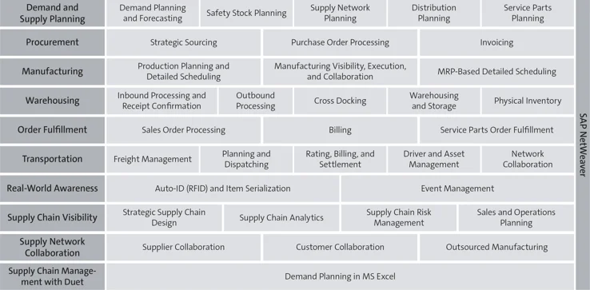

# SAP’s Offerings for Materials Management

SAP currently provides two major enterprise systems (business suites) that support Materials Management (MM):

- **SAP ERP (Legacy System)**
- **SAP S/4HANA (Next-Generation System)**

Both systems allow users to perform core MM activities such as procurement and inventory management.

## SAP ERP

SAP ERP is SAP’s **legacy business suite** and includes a comprehensive Materials Management module.

### Key Points

- Contains extensive MM functionality and data handling  
- Widely used across industries  
- Official maintenance:
  - Supported until **2027**  
  - Extended support available until **2030**  

---

## SAP S/4HANA

SAP S/4HANA is SAP’s **modern enterprise application suite**, released in **2015**.

### Key Features

- Simplified and optimized processes  
- Real-time data processing  
- Improved performance and user experience  

### Relevant Lines of Business (LoBs)

- **Supply Chain**  
- **Sourcing and Procurement**  
- **Manufacturing**  

These LoBs collectively handle SAP MM functionalities in S/4HANA.

---

## Key Changes in SAP S/4HANA (Compared to SAP ERP)

Organizations migrating from SAP ERP to SAP S/4HANA will encounter several important changes:

---
### Business Partner Model

- Customers and vendors are combined into a **single Business Partner (BP)**  
- Simplifies master data management  
---
### Mandatory Material Ledger

- Always active in S/4HANA  
- Enables:
  - Actual costing  
  - Multi-currency valuation  
---
### Simplified Data Structures

- Reduced number of tables  
- Streamlined data model  
- Improved system performance  
---
### Fiori-Based Transactions

- Replaces traditional SAP GUI screens  
- Provides:
  - User-friendly interface  
  - Role-based access  
  - Enhanced user experience  

---
